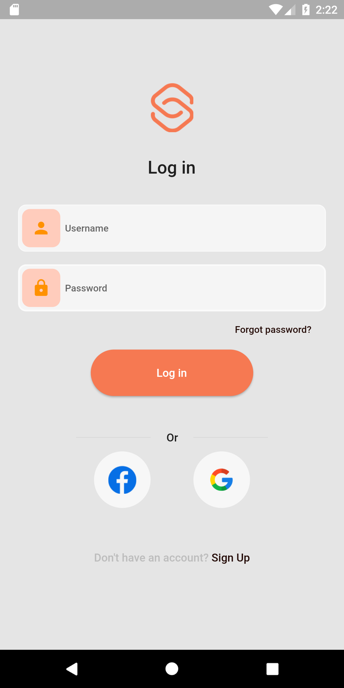
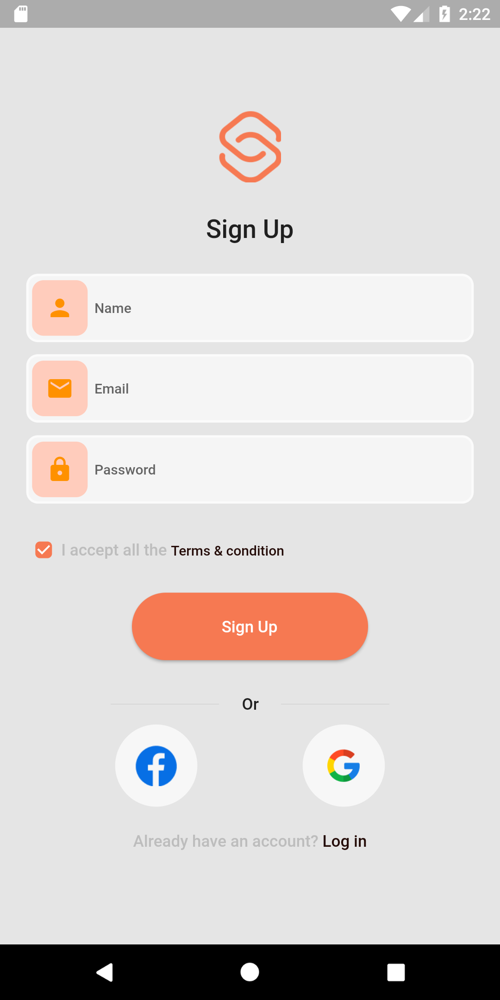
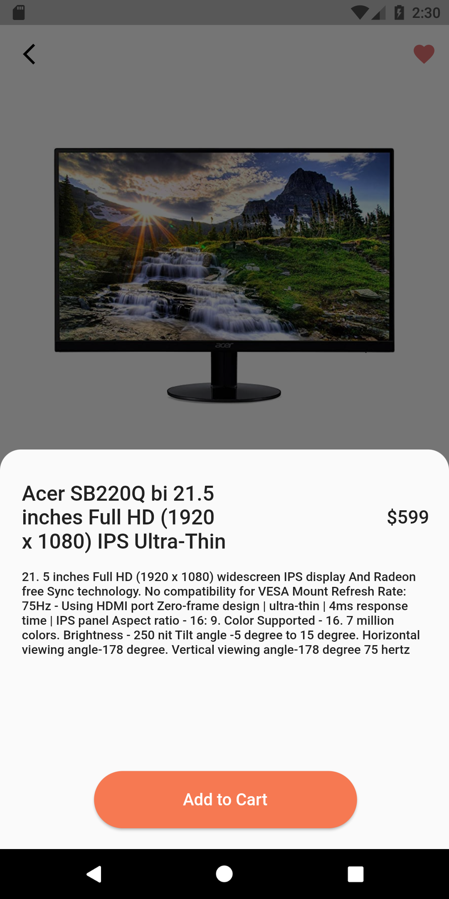
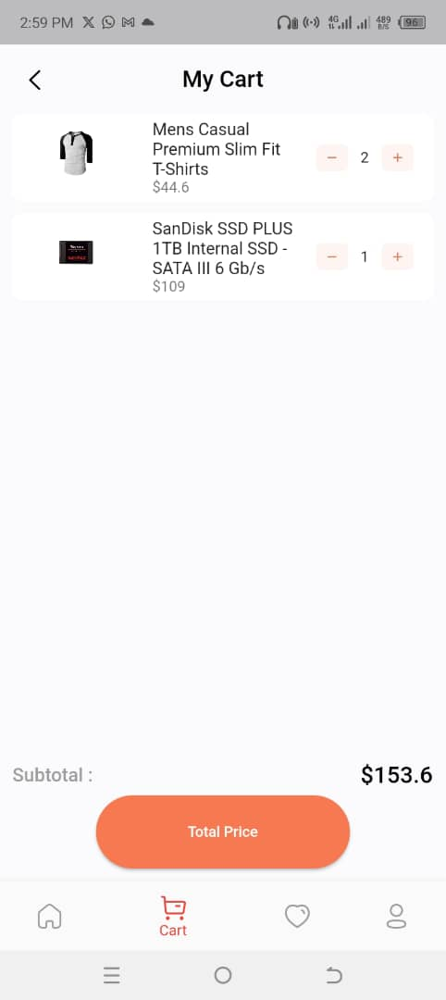
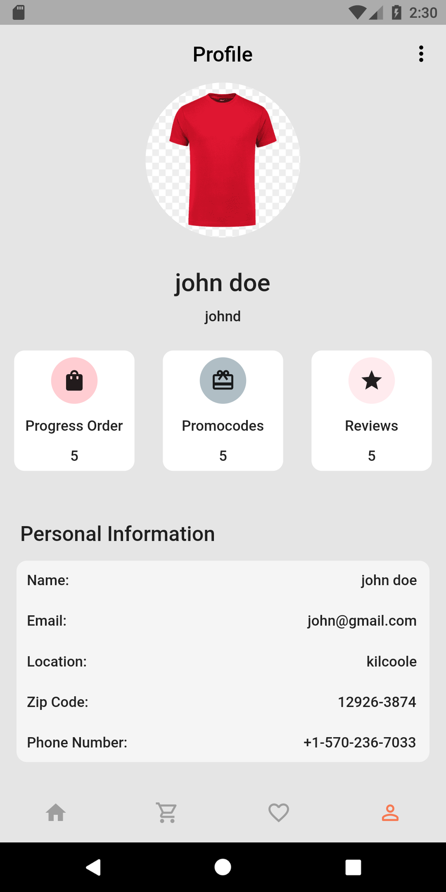

# E_commerce

An online shopping app built with Dart and Flutter

## Project About
This project is an e-commerce application that offers users the convenience of online shopping by allowing them to browse and purchase products based on various product categories. The application incorporates user authentication, utilizing a simulated API for user verification and security purposes.

## Packages used:
- flutter_riverpod
- dio
- hive

## screenshots

## Login

## Signup
beevers

## Home

## View

## Cart

## Profile

